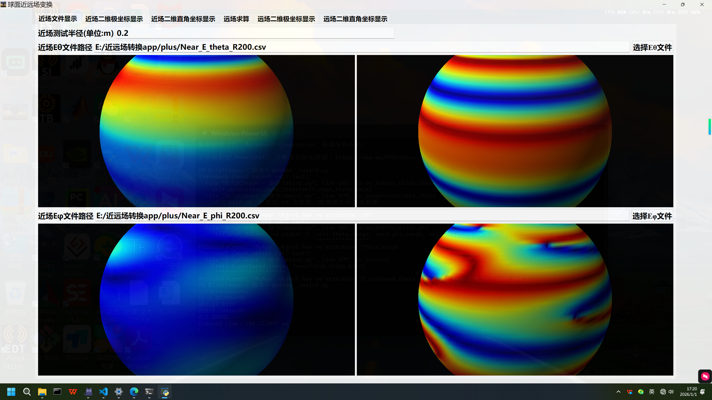
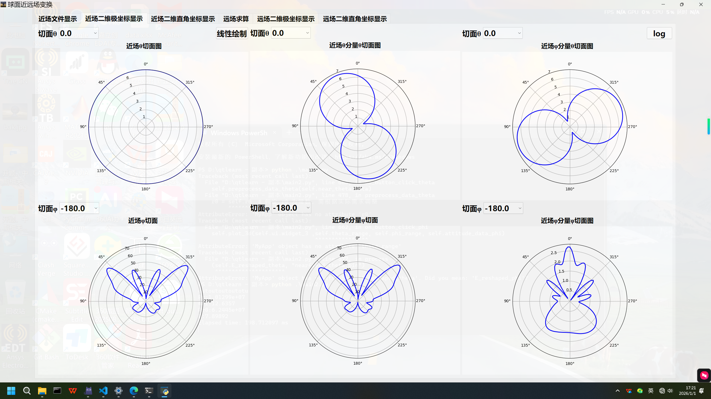
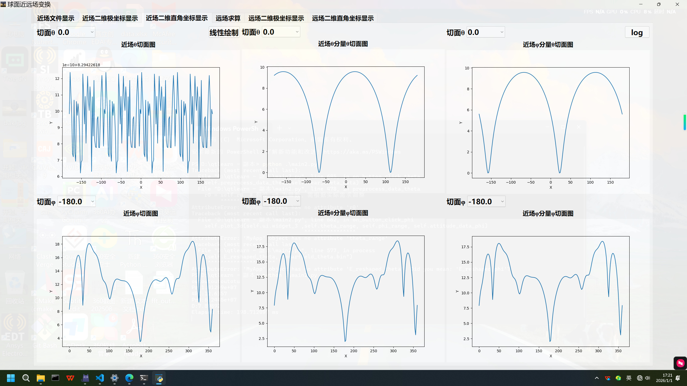
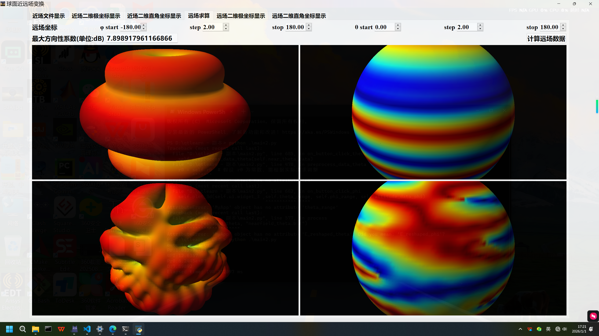
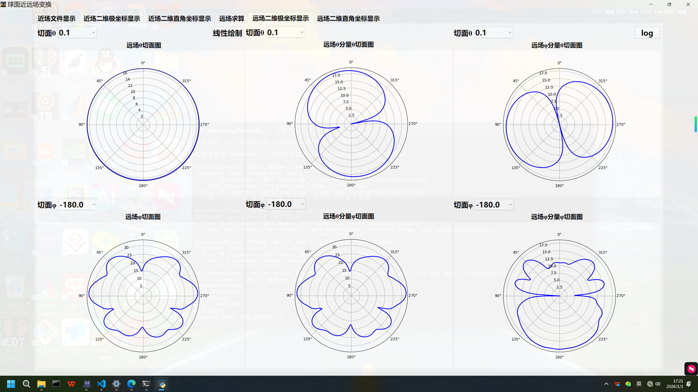
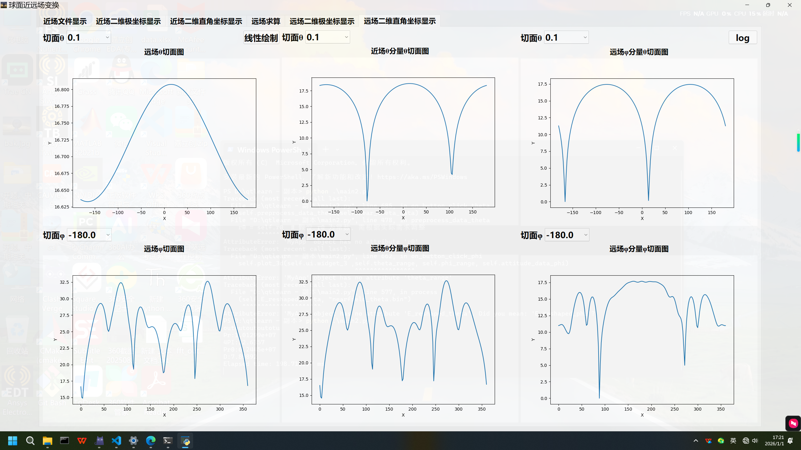

# 球面近远场变换软件（Spherical Near-Field to Far-Field Transformation）

## 一、项目背景

在天线测试中，常见的测试方式包括 **近场测试** 和 **远场测试**。  
由于天线尺寸、测试距离以及测试环境等因素的限制，直接进行远场测试往往成本高、难度大。

因此，工程实践中通常采用 **微波暗室内的近场测试**，并通过 **近远场变换（Near-Field to Far-Field, NF-FF）算法**，计算得到天线的远场方向图。

在球面近远场变换过程中：

- 采样数据规模大  
- 数值计算复杂度高  
- 对计算性能要求极高  

**计算速度成为影响工程应用的关键指标之一。**

---

## 二、软件介绍

本软件面向 **球面近远场变换算法**，针对大规模数据计算场景，进行了 **GPU 并行计算加速与性能优化**。

### 主要特点

- 🚀 **CUDA 并行加速**：显著提升近远场变换计算速度  
- 🧩 **C++ / CUDA 后端**：核心数值计算模块高性能实现  
- 🐍 **Python 接口封装**：以 `pyd` 形式输出，便于调用  
- 🖥️ **图形化界面（GUI）**：基于 PyQt 的交互式操作界面  
- 📈 **三维方向图可视化**：基于 OpenGL 的实时渲染  

---

## 三、软件架构

```text
┌──────────────┐
│   PyQt GUI   │  ← 用户交互、参数配置
└──────┬───────┘
       │
┌──────▼───────┐
│ Python 控制层 │  ← 数据管理、流程控制
└──────┬───────┘
       │
┌──────▼───────┐
│ CUDA / C++   │  ← 球面近远场变换核心计算
└──────────────┘
```
---

## 四、功能展示
1️⃣ 近场方向图显示
近场三维方向图读取与显示
<p align="center">  </p>
近场极坐标二维方向图（对数 / 线性）
<p align="center">  </p>
近场直角坐标二维方向图（对数 / 线性）
<p align="center">  </p>
2️⃣ 远场方向图计算与显示
远场三维方向图计算与显示
<p align="center">  </p>
远场极坐标二维方向图（对数 / 线性）
<p align="center">  </p>
远场直角坐标二维方向图（对数 / 线性）
<p align="center">  </p>

---

## 五、应用场景

- 天线近场测试数据分析

- 球面近远场变换算法验证

- 天线方向图三维可视化

- GPU 加速电磁计算软件原型

---

## 六、开发环境

- CUDA

- C++ / Python

- PyQt


- OpenGL

